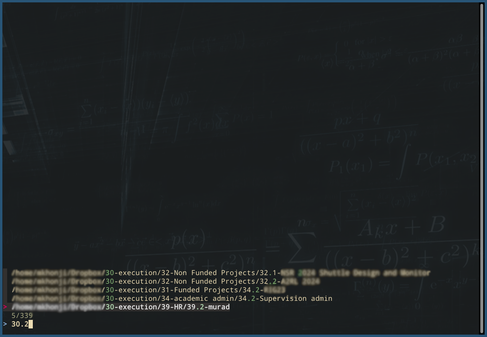

# Johnny Decimal Navigator

A command-line tool for the Fish shell that leverages the power of FZF to enable quick navigation of files and directories organized according to the Johnny Decimal system.



## Features

- Quick navigation to directories using FZF.
- Integration with the Johnny Decimal filing system for organized directories.

## Prerequisites

- Fish shell
- FZF

## Installation

1. Clone the repository to your local machine.
2. Copy `functions/jd.fish` to your Fish functions directory, usually located at `~/.config/fish/functions/`.

## Configuration

Add a keyboard shortcut to your Fish configuration file (`~/.config/fish/config.fish`) to use the `jd` command:

```fish
bind \co jd
```

This will bind the Ctrl+O shortcut to the jd function, allowing quick activation within the terminal.


